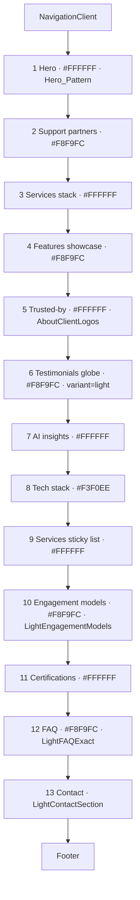
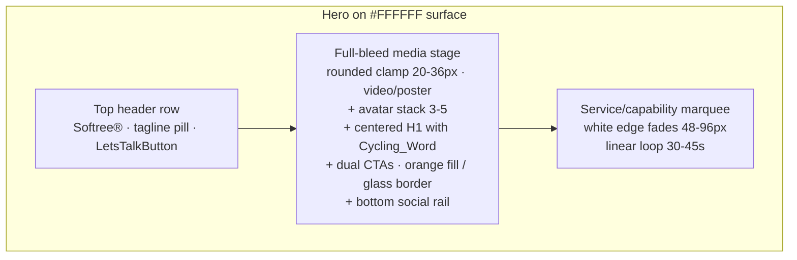
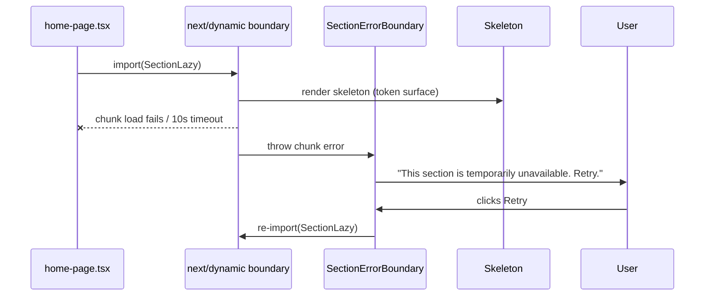

# Design Document

## Overview

This design redesigns the homepage at `/` (rendered by `src/app/page.tsx` via `src/app/home-page.tsx`) to adopt the same visual, typographic, color, motion, and composition system already established by the About Us page at `/about-us`. The goal is a single coherent design language across the two highest-traffic surfaces of the site, without losing any existing homepage content, links, metadata, or SEO value.

The redesign is **not a content rewrite**. All 13 Preserved_Sections (hero, support partners, services stack, features showcase, trusted-by client logos, testimonials globe, AI insights/blog, tech stack, services sticky list, engagement models, certifications, FAQ, contact) are kept in their existing top-to-bottom order, with their existing copy, images, link `href` targets, and CTA destinations. What changes is the visual shell each section is rendered in: surface color, typography scale, accent color discipline, section rhythm, badge/headline/body composition, motion tokens, and reduced-motion behavior.

The unifying source of truth is twofold:

1. The **Motion_System** in `src/lib/motion.ts` (`EASE`, `EASE_T`, `DUR`, `STAGGER`, `REVEAL`, `VIEWPORT`, `prefersReducedMotion`) — every animation in homepage-owned section files MUST consume these tokens directly.
2. The **About_Page component pattern**: `AvooraHero` for the hero, `LightAboutMerged` for the stat-plus-content split, `AboutClientLogos`/`AboutTeamSection`/`AwardsMarqueeSection` for the marquee + light card patterns, `LightEngagementModels`, `LightFAQExact`, `LightContactSection`, and `OffshoreTestimonialsGlobe` (in `variant="light"`).

Where a Preserved_Section already has a direct light-surface counterpart used by About (`LightContactSection`, `LightFAQExact`, `LightEngagementModels`, `OffshoreTestimonialsGlobe` light, `AboutClientLogos`), the homepage **reuses that exact component** — no styling duplication. Where it does not (e.g. `AiInsightsBlog`, `TechStack`, `support-partners`, `ServicesStackedSlides`, `FeaturesShowcase`, `LightServicesStickyList`, `certification`), the existing component is restyled in place to comply with the Design_Tokens, the Section_Rhythm, and the badge → headline → body composition.

The hero is the largest single change. The current `TransferredSoftreeHero` is a dark, GSAP-pinned, mask-burst composition on a `#1a2a3a`/`#fafaf9` canvas. It is replaced with a hero that follows the **Hero_Pattern** established by `AvooraHero`: white page surface, top header row (wordmark + tagline pill + `LetsTalkButton`), full-bleed rounded media stage with avatar stack and a centered headline containing a Cycling_Word, dual CTAs (orange-fill primary, glass-border secondary), bottom social rail, and a service/capability marquee directly beneath. The existing value proposition (offshore engineering partner + scalable Microsoft + AI teams) is preserved in the new headline copy.

This is fundamentally a **front-end visual refactor**. There is no new business logic, no new data model, no new API. The Sanity data layer, where it is used today, is preserved unchanged. Where it is not used today, it is not introduced.

## Architecture

### Page Tree (Top to Bottom)

The redesigned page tree at `/` is:

```
<Page>
  <NavigationClient />        ← unchanged, first child of page tree
  <main>
    <SoftreeHero />           ← NEW (replaces TransferredSoftreeHero, follows Hero_Pattern)
    <SupportPartnersLight />  ← restyled support-partners
    <ServicesStackedSlidesLight /> ← restyled ServicesStackedSlides
    <FeaturesShowcaseLight /> ← restyled FeaturesShowcase
    <TrustedByLight />        ← reuses AboutClientLogos
    <OffshoreTestimonialsGlobe variant="light" /> ← shared component, light variant
    <AiInsightsBlogLight />   ← restyled ai-insights-blog
    <TechStackLight />        ← restyled tech
    <LightServicesStickyList /> ← already light, audited for token compliance
    <LightEngagementModels /> ← shared with About
    <CertificationsLight />   ← restyled certification
    <LightFAQExact />         ← shared with About
    <LightContactSection />   ← shared with About
  </main>
  <Footer />                  ← unchanged, last child of page tree
</Page>
```

The 13 Preserved_Sections render in the exact order specified by Requirement 3.1. `NavigationClient` is the first child of the page tree above all Preserved_Sections; `Footer` is the last child below them (Requirement 3.8).

### Layering

```
┌─────────────────────────────────────────────────────────────┐
│  src/app/page.tsx              (server component, metadata) │
│        ↓                                                    │
│  src/app/home-page.tsx         (client, page tree, lazy)    │
│        ↓                                                    │
│  Section components            (one file per section)       │
│        ↓                                                    │
│  Shared primitives:                                         │
│    • src/lib/motion.ts            (EASE, DUR, REVEAL...)    │
│    • src/components/qc/shared/SpotlightCard.tsx             │
│    • src/components/qc/homepage-light/Grainient.tsx         │
│    • LetsTalkButton (extracted from AvooraHero)             │
│    • SectionHeader (badge → headline → body, NEW shared)    │
└─────────────────────────────────────────────────────────────┘
```

`src/app/page.tsx` keeps its existing `metadata` export byte-for-byte (Requirement 9.1). `src/app/home-page.tsx` keeps its `next/dynamic` lazy boundaries (Requirement 6.1) but swaps each lazy import to the restyled or shared light variant.

### Section Composition Pattern

Every Preserved_Section follows the same outer shell:

```tsx
<section
  data-section="<slug>"
  className="
    relative w-full
    bg-[#FFFFFF | #F8F9FC | #F3F0EE]   // exactly one of three canvas tokens
    py-20 md:py-24 lg:py-28            // Section_Rhythm vertical rhythm
  "
>
  <div className="mx-auto max-w-[1400px] px-6 lg:px-12">
    <SectionHeader
      badge="<UPPERCASE LABEL>"        // tracking-[0.18em..0.22em], leading dot
      accent="#FF6B00 | #FF5812 | #1852FF"
      headline="<H2 / display heading>"
      body="<optional supporting copy>"
    />
    {/* section-specific content (cards, marquee, accordion, grid, ...) */}
  </div>
</section>
```

The badge → headline → body order is enforced (Requirement 1.7). The container is centered and capped at `1400px` with `px-6 lg:px-12` gutters across every viewport (Requirement 1.4). The outer surface is exactly one of `#FFFFFF`, `#F8F9FC`, or `#F3F0EE` (Requirement 1.1) — no other solid color, gradient, or image is applied as the outer section surface.

### Surface Cadence

To match the About rhythm without monotone whiteness, surface colors alternate across the page:

| # | Section | Surface |
| --- | --- | --- |
| 1 | Hero | `#FFFFFF` |
| 2 | Support partners | `#F8F9FC` |
| 3 | Services stack | `#FFFFFF` |
| 4 | Features showcase | `#F8F9FC` |
| 5 | Trusted-by client logos | `#FFFFFF` |
| 6 | Testimonials globe | `#F8F9FC` |
| 7 | AI insights / blog | `#FFFFFF` |
| 8 | Tech stack | `#F3F0EE` (warm break) |
| 9 | Services sticky list | `#FFFFFF` |
| 10 | Engagement models | `#F8F9FC` |
| 11 | Certifications | `#FFFFFF` |
| 12 | FAQ | `#F8F9FC` |
| 13 | Contact | dark-on-light card system inside `#FFFFFF` (matches `LightContactSection` as used by About) |

This cadence is a direct application of the Design_Tokens canvas list and contains zero non-token surface values (Requirement 1.1).

### Surface ↔ Section Diagram



### Visual Parity Mapping (Requirement 11)

Requirement 3.1 mandates the 13-section top-to-bottom page order. Requirement 11.1 lists seven section types ("hero, About-style stat/content split, marquee, engagement-models accordion, testimonials block, FAQ block, contact block") that must each pull surface color, badge style, heading scale, card corner radius, and CTA shape from the same Design_Tokens values as their About_Page counterpart. These two requirements are reconciled as follows: **Requirement 3.1 governs page order; Requirement 11.1 enumerates the subset of homepage sections that have a direct About_Page counterpart and are therefore subject to the side-by-side parity review.** Sections without an About_Page counterpart are governed by Requirement 11.4 and are restyled using Design_Tokens values without being parity-diffed against an About section.

The mapping below is the ground truth for the Requirement 11 sign-off checklist:

| Homepage section (3.1 order) | About_Page counterpart | Parity-reviewed? | Source of restyle |
| --- | --- | --- | --- |
| 1. Hero | `AvooraHero` (Hero_Pattern) | Yes (11.1: "hero") | Reuse pattern via `SoftreeHero` |
| 2. Support partners | — (no counterpart) | No (11.4) | Restyled in place from Design_Tokens |
| 3. Services stack | — (no counterpart) | No (11.4) | Restyled in place from Design_Tokens |
| 4. Features showcase | `LightAboutMerged` stat/content split | Yes (11.1: "About-style stat/content split") | Restyled in place to match split |
| 5. Trusted-by client logos | `AboutClientLogos` | Yes (11.1: "marquee") | Reuses `AboutClientLogos` directly |
| 6. Testimonials globe | `OffshoreTestimonialsGlobe` (`variant="light"`) | Yes (11.1: "testimonials block") | Reuses shared component |
| 7. AI insights / blog | — (no counterpart) | No (11.4) | Restyled in place from Design_Tokens |
| 8. Tech stack | — (no counterpart) | No (11.4) | Restyled in place from Design_Tokens (warm break mirrors `AboutTeamSection`) |
| 9. Services sticky list | — (no counterpart) | No (11.4) | Audit-only token compliance |
| 10. Engagement models | `LightEngagementModels` | Yes (11.1: "engagement-models accordion") | Reuses `qc/homepage-light` version |
| 11. Certifications | — (no counterpart) | No (11.4) | Restyled in place from Design_Tokens |
| 12. FAQ | `LightFAQExact` | Yes (11.1: "FAQ block") | Reuses shared component |
| 13. Contact | `LightContactSection` | Yes (11.1: "contact block") | Reuses `qc/homepage-light` version |

The hero's internal service-capability marquee (the one beneath the rounded media stage) carries the "marquee" parity check from 11.1 in tandem with `AboutClientLogos`. The seven sections marked "Yes" are the exact set diffed by the computed-style suite described in Testing Strategy.

### Hero_Pattern (replaces TransferredSoftreeHero)



The hero is a **single section** that fills its own `py-20 md:py-24 lg:py-28` block on `#FFFFFF`, contains its own `max-w-[1440px] px-6 lg:px-12` inner gutter (per `AvooraHero`'s actual implementation, which uses `max-w-[1440px]` for the hero specifically — the slightly wider hero container is the same value the About hero uses), and renders the marquee directly beneath the media stage, all inside the same section element.

### Lazy Loading and Skeletons

The existing `next/dynamic` boundary (Requirement 6.1) is preserved exactly as-is:

```ts
const FeaturesShowcaseLazy = dynamic(() => import("..."), { loading: () => <SectionSkeleton ... /> })
const OffshoreTestimonialsGlobeLazy = dynamic(() => import("..."), { ssr: false, loading: () => <SectionSkeleton ... /> })
const AiInsightsBlogLazy = dynamic(() => import("..."), { loading: () => <SectionSkeleton ... /> })
const TechStackSectionLazy = dynamic(() => import("..."), { loading: () => <SectionSkeleton ... /> })
const LightServicesStickyListLazy = dynamic(() => import("..."), { loading: () => <SectionSkeleton ... /> })
const LightEngagementModelsLazy = dynamic(() => import("..."), { loading: () => <SectionSkeleton ... /> })
const CertificationsLazy = dynamic(() => import("..."), { loading: () => <SectionSkeleton ... /> })
const LightFAQExactLazy = dynamic(() => import("..."), { loading: () => <SectionSkeleton ... /> })
const LightContactSectionLazy = dynamic(() => import("..."), { loading: () => <SectionSkeleton ... /> })
```

The current `SectionSkeleton` paints `bg-[#0a0a0a]` voids — this is replaced with a **token-aware** skeleton that paints the exact surface color the loaded section will paint, sized within ±10% of the loaded section's final height (Requirement 6.2). Each lazy boundary passes the same surface token used by the loaded section, so the skeleton is invisible until content fades in.

```ts
<SectionSkeleton surface="#F8F9FC" minHeight="60vh" />
```

The hero is **not** lazy-loaded — it has a `priority` `next/image` for its primary above-the-fold image (Requirement 6.3) and its video sources are loaded via the `videoLoaded` pattern from `AvooraHero` only after React hydration completes (Requirement 6.4).

### Lazy Chunk Failure Handling

When a lazy chunk fails to load within 10s or returns a network error (Requirement 6.6):



A `SectionErrorBoundary` wraps each lazy boundary. On chunk failure it replaces the skeleton with an inline error message and a Retry button that re-imports the chunk. All other already-rendered sections remain visible.

### Reduced-Motion Architecture

`prefersReducedMotion()` from `src/lib/motion.ts` is consulted at component mount and on `change` events of the matchMedia query (Requirement 10.5). When `Reduced_Motion = true`:

- GSAP entrance timelines short-circuit (`duration: 0.01`, no transform/blur) within 100ms of mount (Requirement 10.1).
- Framer Motion `motion.*` elements with `initial`/`animate` props are wrapped so the `initial` state matches the `animate` state, producing an instant final-state render.
- Marquee CSS animations are paused at translateY(0) and the doubled track is replaced with a single set of items in natural order (Requirement 10.2).
- The Cycling_Word renders only `CYCLING_WORDS[0]` statically (Requirement 10.3).
- No `ScrollTrigger.scrub` is registered (Requirement 10.4).
- Subtle fade/opacity/color transitions under 8px translation that do not loop are still permitted (Requirement 2.8).

### Motion Token Adoption

Every GSAP and Framer Motion call in homepage-owned section files imports its values from `src/lib/motion.ts` (Requirement 4.1):

```ts
import { EASE, EASE_T, DUR, STAGGER, REVEAL, VIEWPORT, prefersReducedMotion } from "@/lib/motion"

// GSAP — string easing
gsap.to(el, { y: 0, opacity: 1, duration: DUR.section, ease: EASE.silk })

// Framer Motion — tuple easing
<motion.div
  initial={REVEAL.up.initial}
  animate={REVEAL.up.animate}
  transition={{ duration: DUR.card, ease: EASE_T.silk }}
/>
```

No homepage-owned section file MAY redeclare `cubic-bezier(...)` literals, hardcoded duration numbers, or inline `prefers-reduced-motion` checks. The existing About components already follow this rule and stand as the reference implementation.

### Accent Color Discipline

The Design_Tokens accent set is exactly three colors: `#FF6B00` (hero badge dot, primary CTA), `#FF5812` (team accent), `#1852FF` (stats, secondary CTA, About badge). Per Requirement 1.3, these are applied **only** to:

- Badge pill borders, backgrounds, and leading dots
- Primary CTA fills (orange) and secondary CTA accents (blue)
- Stat numbers and the `+`/`%` glyphs after them
- Decorative section underlines and stat-row underlines

They are **not** applied to body copy, section backgrounds, secondary/tertiary text, or borders of non-primary controls. Existing accent literals that fall outside this set in homepage section files (e.g. `#f97316`, `#ff7a2f`, `#3b82f6`/`#06b6d4`/`#8b5cf6` partner accents in `trusted-by.tsx`) are removed in favor of the three Design_Tokens accents — the partner-logo colorful glow is replaced by the `AboutClientLogos` neutral hover treatment.

If a new accent literal is ever needed, it MUST first be registered as a named token in `src/lib/motion.ts` or `src/app/globals.css` before it can be referenced (Requirement 4.5).

## Components and Interfaces

### New Shared Components

#### `SectionHeader` (new)

Single source of truth for the badge → headline → body header used by every Preserved_Section.

```tsx
// src/components/homepage-light/SectionHeader.tsx
interface SectionHeaderProps {
  /** UPPERCASE label, 0.18-0.22em letter-spacing, with leading dot */
  badge: string
  /** Accent color for badge dot, badge text, badge border. MUST be one of the three Design_Tokens accents. */
  accent: "#FF6B00" | "#FF5812" | "#1852FF"
  /** H2 headline (the hero overrides this with H1) */
  headline: ReactNode
  /** Optional supporting copy paragraph */
  body?: ReactNode
  /** Override heading level — only the hero passes "h1" */
  as?: "h1" | "h2"
  className?: string
}
```

The component renders a `<header>` (or plain `<div>` for the hero where the section already has `<header>`) with:

1. A pill: `inline-flex items-center gap-2 rounded-full border border-{accent}/20 bg-{accent-tint} px-4 py-2 text-[11px] font-semibold uppercase tracking-[0.20em] text-{accent}` plus a leading `h-1.5 w-1.5 rounded-full bg-{accent}` dot.
2. The headline: `text-[#0a0a1a] font-semibold leading-[0.9] tracking-[-0.04em]` with `clamp(48px, 8vw, 110px)` for `h1` and `clamp(32px, 4.5vw, 56px)` for `h2`.
3. The body: `text-base leading-relaxed text-[#0a0a1a]/70 max-w-[640px]`.

#### `SoftreeHero` (new — replaces TransferredSoftreeHero)

Implements the Hero_Pattern. Internally it is the same composition as `AvooraHero`, generalized so the homepage can pass its own copy and CTA destinations.

```tsx
// src/components/homepage-light/SoftreeHero.tsx
interface SoftreeHeroProps {
  /** Tagline pill text (e.g. "Enterprise Software & AI Solutions") */
  tagline: string
  /** Wordmark; renders with ® superscript */
  wordmark: string
  /** H1 prefix before the cycling word (e.g. "We Build Digital Solutions with") */
  headlinePrefix: string
  /** 3-6 cycling words */
  cyclingWords: [string, string, string, ...string[]]
  /** Primary CTA — orange fill */
  primaryCta: { label: string; href: string }
  /** Secondary CTA — glass border */
  secondaryCta: { label: string; href: string }
  /** Avatar URLs, 3-5 entries */
  avatars: string[]
  /** Background video sources + poster */
  video: { mp4: string; webm?: string; poster: string }
  /** Capability cards for the marquee beneath the media stage */
  marqueeItems: Array<{ n: string; label: string; href: string; img: string }>
}
```

The hero owns: top header row (wordmark + tagline pill + `LetsTalkButton`), full-bleed rounded media stage with corner radius `clamp(20px, 2vw, 36px)`, avatar stack of 3–5 overlapping circular avatars, centered H1 containing the Cycling_Word, dual CTA pair (orange-fill primary + glass-border secondary), bottom social rail, and the service/capability marquee with white edge fades between 48–96px wide and a single linear loop with cycle duration fixed at a value between 30 and 45s (Requirements 2.4, 2.5, 4.6).

The hero copy preserves the value proposition (offshore engineering partner + scalable Microsoft + AI teams, Requirement 2.9). Concretely:

| Slot | Value |
| --- | --- |
| `wordmark` | `"Softree"` (with `®` superscript, kept identical to `AvooraHero`) |
| `tagline` | `"Offshore Engineering Partner"` |
| `headlinePrefix` | `"Scalable Microsoft + AI teams that build"` |
| `cyclingWords` | `["Agentic AI", "Power Platform", "Web Apps", "Data Analytics", "Cloud Solutions"]` |
| `primaryCta` | `{ label: "Start Your Project", href: "/contact" }` |
| `secondaryCta` | `{ label: "Explore Solutions", href: "/services" }` |

These values explicitly retain the offshore engineering partner claim and the scalable Microsoft + AI teams claim verbatim in concept (the cycling word list spells out the Microsoft + AI capabilities, the headlinePrefix carries the offshore partner framing).

When `Reduced_Motion = true`: cycling word freezes on `cyclingWords[0]`, marquee track is held static fully visible (Requirement 2.6). When `Reduced_Motion = false`: cycling word rotates at a fixed interval between 1.5–3s per word (the implementation uses 2.4s, matching `AvooraHero`), marquee loops, entrance animations run via Motion_System tokens (Requirement 2.7).

If the background video does not load within 3s of mount, the poster image stays as the static fallback (it is set both as `<video poster>` and as a CSS `background-image` on the `<video>` element, exactly as in `AvooraHero`); render of the rest of the hero is never blocked, and no user-visible error is surfaced (Requirement 2.10).

#### `LetsTalkButton` (extracted)

Promoted out of `AvooraHero` into its own file at `src/components/qc/shared/LetsTalkButton.tsx` so the homepage hero can import and reuse it without duplication. Same DOM, same hover roll-up, same orange arrow icon. The current inlined version inside `AvooraHero` is replaced with an import of the shared component.

#### `SectionSkeleton` (replacement)

Replaces the dark-void `SectionSkeleton` in `home-page.tsx` with a token-aware version:

```tsx
// src/components/homepage-light/SectionSkeleton.tsx
interface SectionSkeletonProps {
  /** MUST be one of the three Design_Tokens canvas surfaces */
  surface: "#FFFFFF" | "#F8F9FC" | "#F3F0EE"
  /** CSS height value within ±10% of the loaded section's final rendered height */
  minHeight: string
  /** Optional aria-label for the placeholder */
  label?: string
}
```

The skeleton paints `background: surface`, sets `min-height: minHeight`, and renders two thin shimmer bars (`bg-[#0a0a1a]/5` and `bg-[#0a0a1a]/8`) for visual continuity. No dark or off-token color appears.

#### `SectionErrorBoundary` (new)

A React error boundary that wraps each `next/dynamic` import. Its fallback UI matches the page's light surface system:

- Surface = the surface token assigned to the failed section.
- Inline message: "This section is temporarily unavailable."
- Retry button (token-styled, rounded-full pill) that re-imports the failed chunk.

### Reused About Components (no styling changes)

| Section | Component | Path |
| --- | --- | --- |
| Trusted-by client logos | `AboutClientLogos` | `src/components/qc/homepage-light/AboutClientLogos.tsx` |
| Testimonials globe | `OffshoreTestimonialsGlobe` (with `variant="light"`) | `src/components/sections/OffshoreTestimonialsGlobe.tsx` |
| Engagement models | `LightEngagementModels` | `src/components/qc/homepage-light/LightEngagementModels.tsx` (note: About uses the `qc/` version; homepage today uses the older `homepage-light/` version — homepage migrates to the `qc/` version for parity with About per Requirement 11.1) |
| FAQ | `LightFAQExact` | `src/components/homepage-light/LightFAQExact.tsx` |
| Contact | `LightContactSection` | `src/components/qc/homepage-light/LightContactSection.tsx` (homepage migrates from the older `homepage-light/` version to the `qc/` version for the same reason) |

These components MUST be imported and rendered as-is. The homepage MUST NOT duplicate their styles into local components (Requirement 3.5). The homepage MUST NOT override their themeable color props with values outside the Design_Tokens accent set (Requirement 4.4) — the only override is `variant="light"` on `OffshoreTestimonialsGlobe`.

### Restyled Existing Components (in place)

These keep their content (text, images, links, CTAs) but adopt the new outer shell, badge → headline → body header, light surface, and Motion_System tokens. Their files are edited in place; no duplicate "light" variants are forked:

| Section | File | Restyle Summary |
| --- | --- | --- |
| Support partners | `src/components/sections/support-partners.tsx` | Outer surface → `#F8F9FC`. Drop the procedural canvas background (replace with the white card pattern). Heading → `SectionHeader` with blue `#1852FF` accent. All animations reroute to `EASE.silk` / `DUR.section` / `STAGGER.default`. |
| Services stack | `src/components/sections/ServicesStackedSlides.tsx` | Outer surface → `#FFFFFF`. Replace black backdrops on stacked slides with `#F8F9FC` card surfaces and hairline borders (`border-[#0a0a1a]/10`). Heading → `SectionHeader` with orange `#FF6B00` accent. The stack-slide GSAP timeline uses Motion_System tokens; the section's `ScrollTrigger.pin` is audited to ensure it does not pin for more than 50% of viewport height (Requirement 6.7). |
| Features showcase | `src/components/features/FeaturesShowcase.tsx` | Outer surface → `#F8F9FC`. Cards adopt `rounded-[20px]/[28px]`, `border-[#0a0a1a]/10`, soft shadow `shadow-[0_8px_28px_-12px_rgba(10,10,26,0.12)]`. `SpotlightCard` from `qc/shared` is used for any card that requires a cursor-following radial glow (Requirement 4.2). Heading → `SectionHeader`, blue `#1852FF` accent. |
| AI insights / blog | `src/components/sections/ai-insights-blog.tsx` | Outer surface → `#FFFFFF`. Featured + recent article cards adopt the About card system (`rounded-2xl border border-[#0a0a1a]/10 bg-white shadow-[0_8px_28px_-12px_rgba(10,10,26,0.12)]`). Hover lifts via `motion.div whileHover={{ y: -4 }}` with `EASE_T.silk` / `DUR.card`. Heading → `SectionHeader`, blue `#1852FF` accent. |
| Tech stack | `src/components/sections/tech.tsx` | Outer surface → `#F3F0EE` (warm break that mirrors `AboutTeamSection`). The current dark gradient panel is removed; logos render on a single white card with `rounded-[28px]` and the same hairline border. Heading → `SectionHeader`, orange `#FF6B00` accent. |
| Services sticky list | `src/components/homepage-light/LightServicesStickyList.tsx` | Already light. Audit-only: replace any inline `cubic-bezier(...)` with `EASE.silk` / `EASE.out`, replace inline durations with `DUR.section` / `DUR.card`, ensure accent literals match the Design_Tokens set. |
| Certifications | `src/components/sections/certification.tsx` | Outer surface → `#FFFFFF`. Cards become small white tiles with hairline borders; heading → `SectionHeader`, blue `#1852FF` accent. Existing `power3.out` GSAP eases are mapped to `EASE.silk` (the existing comment in `support-partners.tsx` already documents this mapping). |

### Data and Sanity Compatibility

For every Preserved_Section, the Sanity-vs-hardcoded behavior is preserved (Requirement 8). A search of `src/components/sections/**` and `src/components/homepage-light/**` shows no current homepage section imports from `@/sanity/client` or runs a GROQ query — every Preserved_Section currently uses hardcoded content. **The redesign therefore does NOT add a new Sanity query, schema, or content fetch for any Preserved_Section** (Requirement 8.3).

If a future Sanity-backed section is added (out of scope for this redesign), the section MUST follow the fallback contract:

- Timeout the fetch at 5s.
- On null/undefined/empty array, render the hardcoded fallback content (Requirement 8.4).
- The Equivalent_Replacement rule from Requirement 3.3 applies: the replacement string must preserve original semantic intent and the original `href` target.

## Data Models

This is a visual refactor — there are no new persisted data models. The only typed surfaces introduced are the **prop interfaces** for the new shared components, which are documented in **Components and Interfaces** above.

### Design Token Surface (informational, not persisted)

The Design_Tokens described in the requirements correspond to existing exports from `src/lib/motion.ts` and existing CSS custom properties in `src/app/globals.css`. They are summarized here as a typed reference table to make compliance checking unambiguous:

```ts
// Conceptual token map (compiled from existing files)
type DesignTokens = {
  canvas: {
    page: "#FFFFFF"
    panel: "#F8F9FC"
    warm: "#F3F0EE"
  }
  fg: {
    primary: "#0a0a1a"
    secondary: "rgba(10,10,26,0.7)"  // expressed as `#0a0a1a/70`
    tertiary: "rgba(10,10,26,0.6)"   // expressed as `#0a0a1a/60`
  }
  accent: {
    heroPrimary: "#FF6B00"
    teamWarm: "#FF5812"
    statBlue: "#1852FF"
  }
  type: {
    hero: { fontSize: "clamp(48px, 8vw, 110px)"; weight: 600; lineHeight: 0.9; tracking: "-0.04em" }
    section: { fontSize: "clamp(32px, 4.5vw, 56px)"; weight: 600 | 700 }
    body: { fontSize: "14px..16px"; lineHeight: 1.6 }
  }
  surface: {
    radius: { sm: "20px"; md: "28px"; lg: "36px"; panel: "rounded-2xl" }
    border: "border-[#0a0a1a]/10 | border-gray-200"
    softShadow: "shadow-[0_8px_28px_-12px_rgba(10,10,26,0.12)]"
  }
  motion: {
    ease: typeof EASE                   // from src/lib/motion.ts
    easeT: typeof EASE_T
    duration: typeof DUR
    stagger: typeof STAGGER
    reveal: typeof REVEAL
    viewport: typeof VIEWPORT
  }
  marquee: {
    edgeFadeMin: "48px"
    edgeFadeMax: "96px"
    cycleMin: "30s"
    cycleMax: "45s"
    edgeGradientLeft: "linear-gradient(90deg, #fff 0%, transparent 100%)"
    edgeGradientRight: "linear-gradient(270deg, #fff 0%, transparent 100%)"
  }
}
```

If a new accent literal is ever required by the design, it MUST first be registered in `src/lib/motion.ts` or `src/app/globals.css` (Requirement 4.5). The redesign does not introduce any new accent literals beyond the three already present.

### Hero Content Model (in-component constants)

```ts
// src/components/homepage-light/SoftreeHero.tsx
const HERO = {
  wordmark: "Softree",
  tagline: "Offshore Engineering Partner",
  headlinePrefix: "Scalable Microsoft + AI teams that build",
  cyclingWords: [
    "Agentic AI",
    "Power Platform",
    "Web Apps",
    "Data Analytics",
    "Cloud Solutions",
  ] as const,
  primaryCta: { label: "Start Your Project", href: "/contact" },
  secondaryCta: { label: "Explore Solutions", href: "/services" },
  avatars: [...],          // exactly 5 URLs, mirrors AvooraHero shape
  video: { mp4, webm, poster },
  marqueeItems: [...],     // 5 capability cards
} as const
```

This is a TypeScript constant module-locally defined. It is not persisted, not exposed via Sanity, and not configurable at runtime.

### Metadata Surface (preserved)

The `metadata` export in `src/app/page.tsx` keeps the following user-visible string values byte-for-byte (Requirement 9.1):

- `title`: `"Softree | Power Platform, AI, Data & Modern App Development"`
- `description`: `"Softree delivers Power Platform solutions, AI-driven applications, data engineering, and modern web development using React, Next.js, and cloud technologies."`
- `openGraph.title`: `"Softree | AI & Modern Application Development"`
- `openGraph.description`: `"Build scalable AI-powered and modern web applications with Softree."`
- `twitter.title`: `"Softree | AI, Data & Web Development"`
- `twitter.description`: `"Power Platform, AI solutions, and modern web development services."`
- `alternates.canonical`: `"https://www.softreetechnology.com/"` — this is also the canonical URL value rendered in `<head>` per Requirement 9.4.

Non-content fields (key ordering, `images`, structured fields) MAY be modified per Requirement 9.3.

## Error Handling

### Lazy Chunk Failures

Every `next/dynamic` lazy boundary is wrapped in a `SectionErrorBoundary` that:

1. Times out the chunk import at 10s using `Promise.race([import(...), timeoutPromise(10000)])`.
2. On timeout or network error, replaces the skeleton with an inline error card (rounded-2xl, `border-[#0a0a1a]/10`, on the section's surface token). The card text reads: `"This section is temporarily unavailable."` and a Retry button re-imports the chunk on click (Requirement 6.6).
3. Keeps all other already-rendered sections visible.

### Hero Video Failure (Requirement 2.10)

The `<video>` element has `poster={video.poster}` and a CSS `backgroundImage: url(${video.poster})`. If the network never resolves the video sources within 3s of hydration:

- A `setTimeout(() => setVideoLoaded(true), 800)` triggers loading attempts; if `loadeddata` does not fire within an additional 3s, a `videoFailed` flag is set and `<source>` elements are removed.
- The poster image remains visible because it is rendered both as `poster` and as the `<video>` element's CSS `background-image`.
- No error UI is shown. The rest of the hero (headline, CTAs, marquee) is never blocked on video readiness.

### Reduced Motion Conflicts

If a third-party component inside a Preserved_Section ignores `prefers-reduced-motion`, the homepage's section wrapper applies a CSS `@media (prefers-reduced-motion: reduce)` override that:

- Sets `animation: none !important` on `[data-marquee-track]`.
- Sets `transition: none !important; transform: none !important; filter: none !important; opacity: 1 !important` on `[data-reveal]`.

This guarantees Requirement 10's behavior even if a sub-component is non-compliant.

### Sanity Fetch Failures (forward-compatible)

The redesign does not introduce new Sanity fetches. If a Preserved_Section already fetches from Sanity (none currently does), its existing failure behavior is preserved. For any future fetch:

- 5s timeout (Requirement 8.4).
- On null/undefined/empty: render the hardcoded fallback string. The `href` target on any link in the fallback string MUST equal the original `href` recorded for that section (Requirement 3.4).

### Internal Link Validation (Requirement 9.5, 9.6)

The redesign preserves every internal link in every Preserved_Section. The required reachable internal link targets are:

- `/contact` (rendered in hero primary CTA + contact section)
- `/services` (rendered in hero secondary CTA + services sticky list)
- `/case-studies` (rendered in AI insights section + LightAboutMerged-style stat block if introduced)
- `/about-us` (rendered in `NavigationClient`)
- Every service deep link present on the pre-redesign homepage (e.g. `/services/ai-intelligence`, `/services/digital-workspace/web-app-development`, `/services/business-applications/power-apps`, `/services/data-analytics/power-bi`, `/services/digital-workspace/sharepoint`, plus any others enumerated by the existing `support-partners`, `ServicesStackedSlides`, and `LightServicesStickyList` data arrays).

A pre-merge link audit script (`scripts/check-homepage-links.mjs`) HEAD-checks each of these against the dev server. Any 404 or `rel="nofollow"` blocks the redesign per Requirement 9.6.

### Accessibility Failure Modes

- **Heading hierarchy violation**: detected by an axe-core unit test on the rendered page DOM; build fails on regression (Requirements 7.1, 7.2).
- **Non-empty `alt` missing on informational image**: same axe-core test; CI fails (Requirement 7.3).
- **Focus indicator below 2px or below 3:1 contrast**: detected by Storybook + axe-core regression test (Requirement 7.4).
- **`aria-live` on cycling word**: explicitly set to `aria-hidden="true"` so AT does not announce word changes (Requirement 7.7). A unit test asserts the attribute is present.

## Testing Strategy

### Property-Based Testing Applicability

This feature is a **UI rendering and visual parity refactor** with no pure-function transformations, no parsers/serializers, no algorithmic logic, and no data model changes. Per the workflow's PBT applicability guidance:

> "PBT IS NOT appropriate for: UI rendering and layout — use snapshot/visual regression tests instead."

There is no meaningful "for all inputs X, property P(X) holds" formulation that captures "the homepage looks like the About page in design language" — that question is answered by snapshot tests, axe-core accessibility tests, computed-style assertions, and human visual review at three breakpoints.

**The Correctness Properties section is therefore intentionally omitted per the workflow rule for non-PBT features.** The redesign is verified through the test categories below.

### Snapshot Tests (Visual Parity, Requirement 11)

Playwright + `@playwright/test` `expect(page).toHaveScreenshot()` snapshots are captured per Preserved_Section at three breakpoints (375px, 768px, 1280px) for both `/` and `/about-us`. The CI job:

1. Renders both pages.
2. Captures a screenshot per section at each breakpoint.
3. Diffs the homepage section against its About counterpart for the seven sections that have a counterpart (hero, About-style stat/content split, marquee, engagement models accordion, testimonials globe, FAQ, contact). Pixel-level identity is not required — what is asserted is the **computed-style equality** described next.

### Computed-Style Tests (Token Compliance)

Per Requirement 11.2, a Vitest + Playwright suite asserts that the following CSS computed properties on equivalent elements between `/` and `/about-us` match exactly:

- `font-family`
- `h1`–`h4` `font-size` and `line-height`
- Accent color literals on badge dot, primary CTA fill, secondary CTA accent, stat numbers (must be one of `rgb(255,107,0)`, `rgb(255,88,18)`, `rgb(24,82,255)`)
- Badge pill `padding`, `border-radius`, `border-color`
- Card `border-radius` and `box-shadow`
- Motion easing curves (extracted from CSS animation `animation-timing-function` and inline GSAP timeline configs via a custom DOM probe)

A token-value mismatch on any attribute fails the build (Requirement 11.3).

### Static Token Audit (Requirement 1.1, 1.3, 1.6, 4.1, 4.5)

A custom ESLint rule (`no-untokenized-design-literals`, scoped to `src/components/sections/**` and `src/components/homepage-light/**` and `src/components/qc/homepage-light/**`) flags:

- Surface color literals not in `["#FFFFFF", "#F8F9FC", "#F3F0EE"]` on any `bg-[#...]` class or `background:` style on a top-level `<section>`.
- Accent color literals not in `["#FF6B00", "#FF5812", "#1852FF"]` outside of token definition files.
- `cubic-bezier(...)` literals outside `src/lib/motion.ts`.
- Inline `prefers-reduced-motion` `matchMedia` checks (must use `prefersReducedMotion()` from `@/lib/motion`).

This rule is run in CI as `pnpm lint` and blocks merge on violation.

### Accessibility Tests (Requirement 7)

Vitest + `@axe-core/react` integration test on the rendered `/` DOM asserts:

- Exactly one `<h1>` with a non-empty accessible name 1–120 chars.
- Logical heading hierarchy (no skipped levels).
- Every `` has `alt` (informational) or `alt=""` (decorative).
- Every interactive control has an accessible name.
- One `<header>`, one `<main>`, one `<footer>`; first focusable element is a skip link to `<main>`.
- `aria-hidden="true"` on the cycling-word region.

Plus a Playwright keyboard-navigation test that Tab-walks the page and asserts:

- Every interactive element receives focus.
- Focus indicator computed `outline-width >= 2px` and `outline-color` contrast ≥ 3:1 against both element surface and background (computed via the WCAG contrast algorithm in test code).

### Reduced Motion Tests (Requirement 10)

Playwright launches with `--force-prefers-reduced-motion`, then asserts:

- Within 100ms of mount, every `[data-reveal]` element has `opacity: 1` and `transform: none`.
- Every `[data-marquee-track]` element has `animation-play-state: paused` AND `transform: matrix(1, 0, 0, 1, 0, 0)` (zero translation).
- The cycling word's text content equals `cyclingWords[0]` and does not change over a 6s observation window.
- No `ScrollTrigger.scrub` instances are registered (asserted via `window.ScrollTrigger.getAll().every(t => !t.vars.scrub)`).

A second Playwright run without the flag asserts the cycling word DOES rotate within 1.5–3s.

### Responsive Tests (Requirement 5)

Playwright runs the page at 360px, 768px, 1024px, 1280px, and 1440px and asserts:

- `document.documentElement.scrollWidth <= window.innerWidth` (no horizontal overflow).
- At 360px, hero header row's children stack vertically and headline `font-size` is between 28px and 48px.
- At < 1024px, every two-column section's `grid-template-columns` resolves to a single column (computed-style check).
- For coarse-pointer emulation (`hasTouch: true`) at ≤ 1024px, every interactive target's bounding box is ≥ 44×44px and adjacent target spacing is ≥ 8px.

### Performance Tests (Requirement 6)

Lighthouse CI (already wired in `.github/workflows/lhci.yml`) is extended to:

1. Capture 3 mobile-preset Lighthouse runs against the deployed `/` route.
2. Compare the median Performance score against a stored baseline (the median score recorded against the pre-redesign homepage, captured once before the redesign branch is merged).
3. Fail the build if the post-redesign median is lower than the baseline by any margin (Requirement 6.5, tolerance 0).

A Cumulative Layout Shift assertion verifies skeleton-to-final height delta stays within ±10%:

```ts
test("skeleton CLS stays under 0.05", async ({ page }) => {
  const cls = await measureCLS(page)
  expect(cls).toBeLessThan(0.05)
})
```

A separate test asserts no `ScrollTrigger.pin` pins for more than 50% of viewport height (Requirement 6.7).

### Metadata Tests (Requirement 9)

A Vitest unit test imports `metadata` from `src/app/page.tsx` and asserts byte-for-byte equality against fixtures captured before the redesign begins. Any drift in `title`, `description`, `openGraph.title`, `openGraph.description`, `twitter.title`, or `twitter.description` fails the test.

A Playwright test asserts the rendered `<head>` contains `<link rel="canonical" href="https://www.softreetechnology.com/">`.

### Internal Link Reachability (Requirement 9.5, 9.6)

`scripts/check-homepage-links.mjs` extracts every `<a href>` from the rendered homepage DOM and HEAD-requests each internal link against the running dev server. The script fails if:

- Any link in the required set (`/contact`, `/services`, `/case-studies`, `/about-us`, every service deep link present pre-redesign) is missing.
- Any required link returns non-200.
- Any required link has `rel="nofollow"` set.

### Unit Tests (Component-Level)

Standard Vitest + React Testing Library tests for:

- `SectionHeader`: renders badge with leading dot, uppercase text, accent-tinted border; applies `as="h1"` only when passed.
- `SoftreeHero`: rotates cycling word at 2.4s intervals; freezes on first word under reduced motion; falls back to poster image when video sources are blocked (simulated via Playwright `route.abort()`).
- `SectionErrorBoundary`: renders fallback on chunk import failure; Retry button re-imports the chunk.
- `SectionSkeleton`: paints exactly the surface token passed in; applies the requested `min-height`.
- `LetsTalkButton`: renders the roll-up text + arrow; honors `compact` prop; resolves `href` to `/contact`.

### Manual Visual Parity Sign-Off (Requirement 11.3)

Per Requirement 11.3, the redesign is considered **signed off only after a reviewer records a pass result for every section listed in 11.1 across every breakpoint listed in 11.2**, recorded in a sign-off checklist artifact (`docs/homepage-redesign-signoff.md`) committed to the redesign branch. Any token-value mismatch surfaced by the computed-style suite OR by a manual reviewer marks that attribute as fail and blocks sign-off until corrected.
