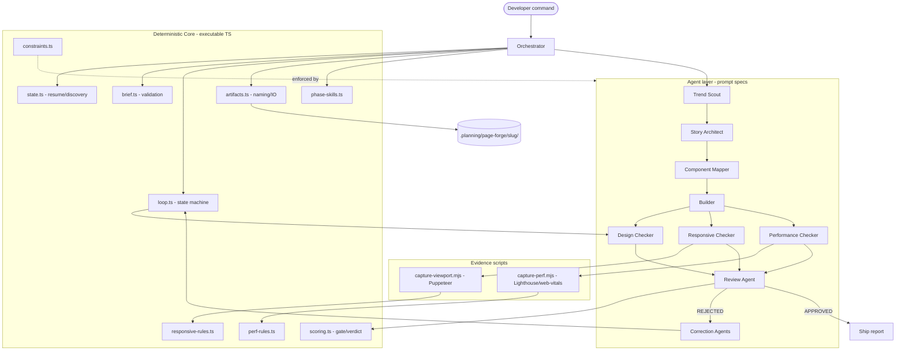
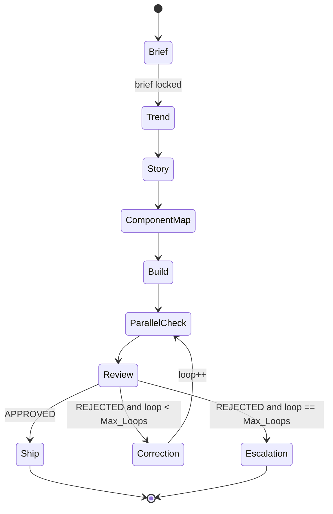

# Design Document

## Overview

The Page Forge Agent System (Page_Forge) is a **design-time authoring pipeline** that turns a page brief into a production-ready page inside the existing Softree marketing site, then loops design/responsive/performance checkers and correction agents until every scored dimension clears a quality gate. It formalizes the behavior sketched in the `.agents/skills/awwwards-page-loop/` skill into an implementable, testable, orchestrated system.

The key architectural insight driving this design is a **separation between two kinds of work**:

1. **Deterministic core (executable TypeScript)** — the parts that must be correct, repeatable, and testable: the scoring/gate engine, the loop state machine and resume logic, the artifact naming/state model, Brief validation (threshold/Max_Loops range clamping), the responsive/performance rule evaluators, and the evidence-capture scripts (Puppeteer viewport measurement, Lighthouse/web-vitals performance). These live under `scripts/page-forge/` and `src/lib/page-forge/` and are covered by unit and property-based tests (Vitest + fast-check, both already in the stack).

2. **Agent layer (prompt definitions + steering)** — the parts that require judgment: trend selection, story architecture, component mapping, code authoring, and the qualitative scoring of visual/storytelling/motion dimensions. These are defined as agent prompt specifications and steering documents that reuse the existing skill reference files. The agent layer *calls into* the deterministic core (for example, a checker agent runs the Puppeteer script and feeds measurements into the rule evaluator; the Review agent calls the scoring module rather than computing the weighted mean by hand).

This split matters because it lets us make hard guarantees where they count. A human or agent can never accidentally declare APPROVED below threshold, mis-weight the overall score, exceed Max_Loops, or lose loop state, because those decisions are made by pure functions with property-based tests — not by prose in a prompt. Everything that is genuinely subjective stays in the agent layer, but even there the agents are constrained to write structured artifacts (YAML front matter + Markdown) that the deterministic core can parse and validate.

The system is invoked by a developer ("forge page /services/x", "run the page loop", "only fix performance") and produces two kinds of output: **built page code** in the normal source tree (`src/app/<route>/` and `src/components/<feature>/sections/`), and **audit artifacts** in a session workspace at `.planning/page-forge/<slug>/`. It is not a runtime service embedded in the shipped website; nothing from this system ships to production browsers.

### Scope of executable code vs. agent definitions

| Concern | Implementation | Rationale |
| --- | --- | --- |
| Scoring / gate / verdict | Executable module (`scoring.ts`) | Must be exact and testable (Req 13) |
| Loop state machine / counter / resume | Executable module (`loop.ts`, `state.ts`) | Invariants must hold (Req 14, 16) |
| Brief validation (range clamping) | Executable module (`brief.ts`) | Deterministic clamping (Req 2) |
| Artifact naming / discovery | Executable module (`artifacts.ts`) | Resume correctness (Req 1, 16) |
| Responsive rule evaluation | Executable module (`responsive-rules.ts`) | Threshold rules must be exact (Req 10) |
| Performance rule evaluation | Executable module (`perf-rules.ts`) | P0 detection must be exact (Req 12) |
| Viewport evidence capture | Executable script (`capture-viewport.mjs`, Puppeteer) | Objective measurement (Req 11) |
| Performance evidence capture | Executable script (`capture-perf.mjs`, Lighthouse/web-vitals) | Objective measurement (Req 11) |
| Trend / Story / Component decisions | Agent prompt spec + steering | Requires design judgment (Req 3, 6, 7) |
| Code authoring / correction | Agent prompt spec + steering | Requires engineering judgment (Req 8, 14) |
| Qualitative design/motion scoring | Agent prompt spec, feeds `scoring.ts` | Requires taste (Req 9) |
| Skill loading per phase | Config map (`phase-skills.ts`) + orchestrator | Deterministic assignment (Req 5) |
| Constraint enforcement | Shared constants (`constraints.ts`) + agent rules | Brand/stack lock (Req 17) |

## Architecture

### High-level topology



### Phase pipeline and the loop

The Orchestrator runs nine phases in a fixed, non-reorderable sequence (Req 1.1). Phases 0–4 are linear; phases 5–7 form the bounded correction loop; phase 8 terminates.



Each phase transition is gated by an **artifact-existence check**: the Orchestrator persists the completed phase's artifact and verifies it exists in the Artifact_Directory before starting the next phase (Req 1.2). If the write fails, the pipeline halts before the next phase, keeps the in-memory output, and surfaces the write error (Req 1.3, 8.10, 15.4).

### Layering of the deterministic core

```
scripts/page-forge/
  forge.mjs                 # CLI entry — thin; delegates to orchestrator
  capture-viewport.mjs      # Puppeteer breakpoint measurement
  capture-perf.mjs          # Lighthouse / web-vitals capture

src/lib/page-forge/
  orchestrator.ts           # phase sequencing, resume, halt-on-write-fail
  state.ts                  # PipelineState, phase discovery, resume point
  brief.ts                  # Brief parse + range validation/clamping
  loop.ts                   # LoopState, counter, verdict routing
  scoring.ts                # weighted mean, gate, verdict, P0 merge
  responsive-rules.ts       # breakpoint rule evaluation -> Findings
  perf-rules.ts             # performance rule evaluation -> Findings
  artifacts.ts              # artifact path builders, front-matter parse/write
  phase-skills.ts           # phase -> skill entries map
  constraints.ts            # Brand_Tokens, Sacred_UI, forbidden lists, budgets
  types.ts                  # shared domain types
  __tests__/                # Vitest + fast-check
```

The agent layer is defined as prompt/steering specifications colocated with the existing skill under `.agents/skills/awwwards-page-loop/` (the source of truth already there), extended by a machine-readable `pipeline.config.ts` that the Orchestrator loads. The agent specs are unchanged prose; the new work is the executable core they lean on.

### Data and control flow within a loop iteration

1. Builder writes/updates page code and `04-BUILD.md`; Orchestrator verifies the artifact (Req 1.2, 9.1).
2. Orchestrator launches Design/Responsive/Performance checkers concurrently (Req 9.1). Responsive and Performance always run regardless of Design (Req 9.6).
3. Responsive Checker runs `capture-viewport.mjs` (if Puppeteer available), feeds measurements to `responsive-rules.ts`, which emits typed Findings; the checker writes `05b-RESPONSIVE.md` with its `layout_responsive` score (Req 10, 11.1).
4. Performance Checker runs `capture-perf.mjs` (if Lighthouse/web-vitals available), feeds to `perf-rules.ts`, writes `05c-PERFORMANCE.md` (Req 11.2, 12).
5. Design Checker scores `visual_design`, `storytelling`, `motion` qualitatively, writes `05a-DESIGN.md` (Req 9.4).
6. Review Agent parses all `05*` artifacts, calls `scoring.ts` to compute overall, apply the gate, merge/de-dupe P0/P1, and produce a verdict; writes `06-REVIEW.md` (Req 13).
7. If REJECTED and `loop < Max_Loops`: Orchestrator spawns Correction Agents scoped to failed dimensions, they fix P0-before-P1, `loop.ts` increments the counter, correction artifacts are written, and control returns to step 2 (Req 14).
8. If REJECTED and `loop == Max_Loops`: write `08-ESCALATION.md` and stop (Req 14.8).
9. If APPROVED: write `08-VERIFICATION.md` (Req 15).

## Components and Interfaces

### Orchestrator (`orchestrator.ts`)

The controlling module. It owns phase sequencing, prerequisite backfilling, resume, and the halt-on-write-failure guarantee. It never scores or fixes; it delegates.

```ts
interface Orchestrator {
  // Entry point. Resolves resume point from existing artifacts, then runs
  // forward. Backfills any missing prerequisite phases in canonical order.
  run(slug: string, opts: RunOptions): Promise<PipelineOutcome>;

  // Runs exactly one phase; persists + verifies its artifact before returning.
  // Throws HaltError (not swallowed) if the artifact write fails.
  runPhase(state: PipelineState, phase: Phase): Promise<PipelineState>;

  // Handles user interrupts (stop / new-direction / single-dimension / override).
  applyInterrupt(state: PipelineState, interrupt: Interrupt): Promise<PipelineState>;
}

type Phase =
  | "brief" | "trend" | "story" | "component_map" | "build"
  | "parallel_check" | "review" | "correction" | "ship";

const PHASE_ORDER: Phase[] = [
  "brief", "trend", "story", "component_map", "build",
  "parallel_check", "review", "correction", "ship",
];
```

Key behaviors:
- **Fixed order (Req 1.1):** phases only ever advance through `PHASE_ORDER`. `runPhase` asserts the requested phase's prerequisites exist and backfills them first if not (Req 1.7).
- **Write-fail halt (Req 1.3):** `runPhase` calls `artifacts.persist()` then `artifacts.verifyExists()`; on failure it throws a `HaltError` carrying the in-memory output and a human-readable message. The Orchestrator does not advance.
- **Directory containment (Req 1.4):** all artifact writes go through `artifacts.ts`, which rejects any path outside `.planning/page-forge/<slug>/`. The only writes outside that tree are Builder/Correction code edits under `src/` (explicitly allowed).
- **Sacred_UI preservation (Req 1.6):** the Orchestrator passes the Sacred_UI list from `constraints.ts` into every agent invocation and the constraint linter refuses edits to Sacred_UI paths unless the Brief expands scope.

### Brief module (`brief.ts`)

```ts
interface BriefInput {
  route?: string;
  slug?: string;
  pageKind?: PageKind;
  audience?: string;
  contentSource?: string;
  references?: string[];
  maxLoops?: number;      // raw user value, may be out of range
  threshold?: number;     // raw user value, may be out of range
  namedDirection?: string;
  mustPreserve?: string[];
  expandedScope?: string[]; // Sacred_UI components explicitly in scope
}

interface Brief {
  route: FieldState<string>;
  slug: FieldState<string>;
  pageKind: FieldState<PageKind>;
  audience: FieldState<string>;
  contentSource: FieldState<string>;
  references: string[];
  maxLoops: number;        // always in [1,10], defaulted/clamped
  threshold: number;       // always in [0,10], defaulted/clamped
  rejections: RangeRejection[]; // recorded out-of-range values (Req 2.6)
  sacredUi: string[];
  missingRequired: RequiredField[]; // route/slug/contentSource if absent
}

type FieldState<T> = { present: true; value: T } | { present: false };

// Pure: clamps to defaults, records rejections, computes missing required set.
function normalizeBrief(input: BriefInput): Brief;

const DEFAULT_THRESHOLD = 8.5;
const DEFAULT_MAX_LOOPS = 4;
const THRESHOLD_RANGE = { min: 0.0, max: 10.0 } as const;
const MAX_LOOPS_RANGE = { min: 1, max: 10 } as const;
const REQUIRED_FIELDS = ["route", "slug", "contentSource"] as const;
```

`normalizeBrief` is the single source of truth for Req 2.4–2.6: an in-range threshold/Max_Loops overrides the default; an out-of-range value is rejected, recorded in `rejections`, and falls back to the default. Absent required fields (route, slug, contentSource) populate `missingRequired`, which the Orchestrator uses to drive the consolidated question flow (Req 2.7–2.9, 1.5).

### Scoring engine (`scoring.ts`)

The heart of the gate. Pure, fully tested.

```ts
type Dimension =
  | "visual_design" | "storytelling" | "motion"
  | "layout_responsive" | "performance" | "content_honesty";

// Awwwards evaluation standard: Design 40%, Usability 30%, Creativity 20%,
// Content 10% (scored 0..10). The six sub-dimensions roll up into the four
// official categories; sub-weights sum to 1.00 and each category subtotal
// equals its Awwwards weight.
type AwwwardsCategory = "design" | "usability" | "creativity" | "content";

const CATEGORY_WEIGHTS: Record<AwwwardsCategory, number> = {
  design: 0.40,
  usability: 0.30,
  creativity: 0.20,
  content: 0.10,
}; // sums to 1.00

// Which Awwwards category each scored dimension rolls up into.
const DIMENSION_CATEGORY: Record<Dimension, AwwwardsCategory> = {
  visual_design: "design",
  motion: "design",
  layout_responsive: "usability",
  performance: "usability",
  storytelling: "creativity",
  content_honesty: "content",
};

const WEIGHTS: Record<Dimension, number> = {
  visual_design: 0.24,     // Design 0.40 = 0.24 + 0.16
  motion: 0.16,
  layout_responsive: 0.18, // Usability 0.30 = 0.18 + 0.12
  performance: 0.12,
  storytelling: 0.20,      // Creativity 0.20
  content_honesty: 0.10,   // Content 0.10
}; // sums to 1.00; category subtotals equal CATEGORY_WEIGHTS

type Score = number; // 0..10, one decimal
type Severity = "P0" | "P1" | "P2";

interface Finding {
  id: string;
  severity: Severity;
  dimension: Dimension;
  message: string;
  file?: string;
  location?: string;   // section id or line
  open: boolean;
}

interface DimensionScores {
  // A dimension may be unscored if its checker failed (Req 9.8).
  [k: string]: Score | null;
}

interface Verdict {
  verdict: "APPROVED" | "REJECTED";
  overall: Score;
  dimensions: DimensionScores;
  openP0: Finding[];
  failedDimensions: Dimension[]; // dims below 8.0 among scored
}

// Weighted mean over the *scored* dimensions using the fixed Awwwards weights.
function computeOverall(scores: DimensionScores): Score;

// Roll the scored dimensions up into the four Awwwards category scores (0..10).
function computeCategoryScores(scores: DimensionScores): Record<AwwwardsCategory, Score | null>;

// APPROVED iff overall >= threshold AND every required scored dim >= 8.0
// AND no open P0. Otherwise REJECTED. (Req 13.2, 13.3, 13.4)
function evaluateGate(scores: DimensionScores, findings: Finding[], threshold: number): Verdict;

// Merge + de-dupe P0/P1 across checkers, order by user impact. (Req 13.5)
function mergeFindings(reports: CheckerReport[]): Finding[];

const PASS_DIMENSION_MIN = 8.0;
```

Design decisions:
- **Fixed weights sum to 1.0.** A unit test asserts `sum(WEIGHTS) === 1`. When a dimension is unscored (null) due to checker failure (Req 9.8), the gate treats a missing required dimension as *not satisfying* the ≥8.0 requirement, so the verdict cannot be APPROVED with an unscored required dimension. This is the safe direction: incomplete evidence never passes.
- **Never inflate (Req 13.7).** `scoring.ts` only computes; the Review Agent may lower a checker score when evidence is weak but is prohibited (by prompt rule and by the correction-loop invariant that a raise requires a newly-closed Finding) from raising without new evidence.
- **Content honesty (Req 13.8).** If any invented-metric Finding exists, the Review Agent caps `content_honesty` at 5 and records a P0 before calling `evaluateGate`; the presence of the open P0 alone already forces REJECTED.

### Loop controller (`loop.ts`)

```ts
interface LoopState {
  loop: number;          // starts 0 after first build
  maxLoops: number;      // from Brief (1..10)
  lastVerdict: "APPROVED" | "REJECTED" | null;
}

// Route the next action from a verdict + loop state. Pure. (Req 14, 14.8)
type LoopAction =
  | { kind: "ship" }
  | { kind: "correct"; dimensions: Dimension[] }
  | { kind: "escalate" };

function nextAction(state: LoopState, verdict: Verdict): LoopAction;

// Increment after a correction wave records its fixes. (Req 14.4)
function incrementLoop(state: LoopState): LoopState;
```

`nextAction` encodes the termination guarantee (Req 14.8): if `verdict.verdict === "APPROVED"` → ship; else if `state.loop >= state.maxLoops` → escalate; else → correct the failed dimensions. Because `maxLoops` is clamped into `[1,10]` by `brief.ts` and `incrementLoop` is monotonic, the loop cannot run forever.

### State & resume (`state.ts`)

```ts
interface PipelineState {
  slug: string;
  brief: Brief;
  loop: LoopState;
  completedPhases: Set<Phase>;
  currentLoopArtifacts: LoopArtifactSet;
}

// Inspect the Artifact_Directory and compute the resume point. (Req 16.1, 16.2)
function discoverState(slug: string): Promise<PipelineState>;

// The phase to run next given what artifacts exist on disk.
function resumePoint(state: PipelineState): Phase;
```

Resume logic (Req 16.1–16.2):
- Resume from the phase *after* the highest completed phase (by artifact presence).
- If `06-REVIEW.md` records REJECTED and no `07-LOOP-<n>-*` artifact exists for the current loop, resume at the correction phase for that loop.
- Never restart Trend/Story unless the user asks for a new direction (which archives the directory and restarts at Trend — Req 16.4).

### Artifacts module (`artifacts.ts`)

```ts
const ROOT = (slug: string) => `.planning/page-forge/${slug}`;

const ARTIFACT_NAMES = {
  brief: "00-BRIEF.md",
  direction: "01-DIRECTION.md",
  story: "02-STORY.md",
  componentMap: "03-COMPONENT-MAP.md",
  build: "04-BUILD.md",
  design: "05a-DESIGN.md",
  responsive: "05b-RESPONSIVE.md",
  performance: "05c-PERFORMANCE.md",
  review: "06-REVIEW.md",
  verification: "08-VERIFICATION.md",
  escalation: "08-ESCALATION.md",
} as const;

// Loop artifacts: 07-LOOP-<n>-<dimension>.md
function loopArtifactName(n: number, dim: "design" | "responsive" | "performance"): string;

// Guarded write: rejects any path escaping ROOT(slug). (Req 1.4)
function persist(slug: string, name: string, content: string): Promise<void>;
function verifyExists(slug: string, name: string): Promise<boolean>;

// Front-matter (YAML) + Markdown body parse/serialize for typed round-trips.
function parseArtifact<T>(raw: string): { front: T; body: string };
function serializeArtifact<T>(front: T, body: string): string;
```

The front-matter round-trip is the seam that lets the deterministic core read what agents write (scores, verdicts, findings) reliably. It is a serializer/parser pair, so it gets a round-trip property test.

### Evidence-capture subsystems

**Viewport measurement (`capture-viewport.mjs`, Puppeteer):**

```ts
interface ViewportMeasurement {
  breakpoint: 390 | 768 | 1024 | 1440;
  sectionId: string;
  scrollWidth: number;      // for overflow detection
  clientWidth: number;
  horizontalPaddingPx: number;
  touchTargets: { w: number; h: number; selector: string }[];
  pinnedAtBreakpoint: boolean; // is the pin chapter still pinned here
  columnsCollapsed: boolean;
  firstPrimaryContentIndex: number; // order of headings/body/CTA
  firstChromeIndex: number;         // order of media/dividers/controls
}

// Boots the dev/preview server URL, iterates the 4 breakpoints, and returns
// measurements per section. Writes screenshots as evidence files under ROOT.
async function captureViewport(url: string): Promise<ViewportMeasurement[]>;
```

**Performance capture (`capture-perf.mjs`, Lighthouse/web-vitals):**

```ts
interface PerfMeasurement {
  lcpMs?: number;
  lcpElementOpacityZeroUnderLoader: boolean;
  scrollLinkedProps: string[];        // e.g. ["blur", "top"] found in scroll handlers
  gsapContextsWithoutCleanup: string[]; // file:symbol
  heavyPinCount: number;
  globalLayoutHijack: boolean;        // loader/transition on app/layout.tsx
  reducedMotionPathPresent: boolean;
}

async function capturePerf(url: string): Promise<PerfMeasurement>;
```

Both scripts detect tool availability and, when a tool is missing, return a sentinel that the checker records as "performed by inspection, tool absent" (Req 11.4). Static-analysis fields (scroll-linked props, GSAP cleanup, layout hijack) are derived by scanning the built source, so they work even without a running browser.

### Rule evaluators

`responsive-rules.ts` and `perf-rules.ts` are pure functions that turn measurements into typed Findings with fixed severities, encoding Req 10 and Req 12 exactly:

```ts
// Req 10.2 overflow -> P0; 10.3 touch<44 -> P1; 10.4 chrome-before-content -> P1;
// 10.5 mobile-pin -> P0; 10.6 padding bounds -> P1; 10.7 score cap 5.0 on open P0.
function evaluateResponsive(m: ViewportMeasurement[]): { findings: Finding[]; score: Score };

// Req 12.1 LCP opacity0 -> P0; 12.2 scroll-linked blur/filter/layout -> P0;
// 12.3 gsap no-cleanup -> P0; 12.4 pin>1 -> P0; 12.5 layout hijack -> P0;
// 12.6 reduced-motion path required.
function evaluatePerformance(m: PerfMeasurement): { findings: Finding[]; score: Score };
```

### Agent layer interfaces

Each agent is a prompt specification plus an I/O contract. The Orchestrator invokes agents as subagents, passing the shared preamble from `agents.md`, the loaded skills for the phase, and the prior artifacts. Every agent writes exactly one artifact (checkers write their `05*` file; correction agents write their `07-LOOP-<n>-<dim>.md`).

| Agent | Reads | Writes | Scores | May edit code |
| --- | --- | --- | --- | --- |
| Trend Scout | Brief, Design_Data, web refs | `01-DIRECTION.md` | — | No |
| Story Architect | Direction | `02-STORY.md` | — | No |
| Component Mapper | Story, catalog | `03-COMPONENT-MAP.md` | — | No |
| Builder | Component Map | code + `04-BUILD.md` | — | Yes (page scope) |
| Design Checker | code, Story | `05a-DESIGN.md` | visual, story, motion | No |
| Responsive Checker | code, viewport evidence | `05b-RESPONSIVE.md` | layout_responsive | No |
| Performance Checker | code, perf evidence | `05c-PERFORMANCE.md` | performance | No |
| Review Agent | all `05*` | `06-REVIEW.md` | overall (via scoring.ts) | No |
| Correction Agents | `06-REVIEW.md` | `07-LOOP-<n>-<dim>.md` + code | — | Yes (assigned findings only) |

## Data Models

### Domain types (`types.ts`)

```ts
type PageKind = "service" | "about" | "case-study" | "landing";

interface DesignDirection {
  directionId: string;
  name: string;                 // from approved trend bank only (Req 3.3)
  whySoftree: string[];
  dials: { variance: number; motion: number; density: number }; // 0..10 ints
  rejected: { name: string; reason: string }[];
  scrollytellingBudget: { maxPins: 1 };   // Pin_Budget (Req 3.5)
  references: ReferenceSource[];
  influencingDesignData: string[];        // Req 4.1
}

interface ReferenceSource {
  kind: "design_data" | "internet";
  locator: string;              // path or URL
  used: boolean;
  inaccessible?: boolean;       // Req 4.8
  rejectedAspect?: string;      // conflict w/ Brand_Token (Req 4.6)
}

interface ScrollBeat {
  beat: string;                 // Hook, Proof, Mechanism, ...
  sectionId: string;            // unique across beats (Req 6.3)
  emotionalPurpose: string;     // exactly one (Req 6.2)
  scrollBehavior: ScrollBehavior; // one of approved set
  contentGap?: boolean;         // Req 6.6
}

type ScrollBehavior = "static" | "reveal" | "pin-scrub" | "count-up" | "none";

interface ComponentAssignment {
  sectionId: string;
  patternId: string;            // from catalog only (Req 7.3)
  motionLib: "gsap-scrolltrigger" | "framer" | "css" | "none";
  reducedMotionFallback: string;
  mobileStacking: string;
  reusedPrimitive?: "SectionHeader" | "SpotlightCard" | "LetsTalkButton" | "AboutClientLogos";
  unmatchedGap?: boolean;       // Req 7.7
  sacred?: boolean;             // X-LIGHT-CONTACT / X-LIGHT-FAQ (Req 7.6)
}

interface CheckerReport {
  agent: "design-checker" | "responsive-checker" | "performance-checker";
  scores: Partial<Record<Dimension, Score | null>>;
  findings: Finding[];
  evidence: EvidenceRef[];
  failed?: boolean;             // checker itself failed (Req 9.8)
}

interface EvidenceRef {
  kind: "file" | "breakpoint" | "behavior" | "measurement";
  detail: string;
  toolAbsent?: boolean;         // Req 11.4
}

interface ReviewArtifact {
  verdict: "APPROVED" | "REJECTED" | "USER_OVERRIDE";
  loop: number;
  overall: Score;
  dimensions: DimensionScores;
  p0: Finding[];
  p1: Finding[];
}
```

### Artifact state model & lifecycle

The Artifact_Directory `.planning/page-forge/<slug>/` is the persistent state. Presence of an artifact = that phase completed. The naming scheme is the state encoding:

```
00-BRIEF.md            phase brief complete
01-DIRECTION.md        trend complete
02-STORY.md            story complete
03-COMPONENT-MAP.md    map complete
04-BUILD.md            build complete
05a/05b/05c-*.md       parallel check complete (per-checker)
06-REVIEW.md           review complete (front matter: verdict + loop)
07-LOOP-<n>-<dim>.md   correction wave n complete (per fixed dimension)
08-VERIFICATION.md     approved terminal
08-ESCALATION.md       max-loops terminal
archive-<timestamp>/   archived prior run (new-direction interrupt)
```

Resume reads front matter of `06-REVIEW.md` (verdict, loop) plus which `05*`/`07*` files exist to place the cursor. This makes resume a pure function of the directory contents (Req 16.1–16.2).

### Constraints model (`constraints.ts`)

```ts
const BRAND_TOKENS = {
  accent: "#FF5812", cream: "#f8f4ec",
  ink: ["#121417", "#141414"], white: "#ffffff",
} as const;

const FORBIDDEN_AESTHETICS = [
  "purple-ai-mesh", "neon-cyberpunk", "full-page-webgl",
  "glassmorphism-everything", "multi-pin-scroll-hijack",
  "cyan-cyberpunk-palette", "rainbow-gradient",
] as const;

const SACRED_UI = [
  "NavigationClient", "sticky-orange-softree-footer",
  "LightContactSection", "LightFAQExact", "Footer",
] as const;

const ANIMATABLE_PROPS = ["transform", "opacity"] as const;
const PIN_BUDGET = 1;
const BREAKPOINTS = [390, 768, 1024, 1440] as const;
const MOTION_TOKEN_SOURCE = "@/lib/motion";
```

These constants are imported by the rule evaluators (so a purple gradient or a second pin becomes a Finding deterministically) and injected into every agent prompt (so the agent layer honors the same lock). Any phase output violating a constraint is recorded as a P0 Finding (Req 17.8).

## Correctness Properties

*A property is a characteristic or behavior that should hold true across all valid executions of a system — essentially, a formal statement about what the system should do. Properties serve as the bridge between human-readable specifications and machine-verifiable correctness guarantees.*

These properties apply strongly to this feature because the deterministic core is a set of pure functions over large, structured input spaces (score vectors, finding lists, loop states, phase sets, brief inputs, viewport/perf measurements). These are exactly the invariants, round-trips, and metamorphic rules that property-based testing excels at. The agent layer, tooling integration (Puppeteer/Lighthouse launch), and one-shot file creations are covered by example/integration/smoke tests instead (see Testing Strategy).

All property tests use **fast-check** (already in `devDependencies`) with a minimum of 100 iterations. Each test carries a tag comment referencing its numbered property (format shown in the Testing Strategy section).

### Property 1: Phase order is never skipped or reordered

*For any* set of completed phases, the next phase the Orchestrator runs is the earliest phase in `PHASE_ORDER` not yet completed, and it is never a phase whose prerequisites are absent.

**Validates: Requirements 1.1, 1.7**

### Property 2: Prerequisite backfill equals missing predecessors in canonical order

*For any* completed-phase set and requested target phase, the backfill sequence produced by the Orchestrator is exactly the target's missing predecessors, emitted in `PHASE_ORDER` order.

**Validates: Requirements 1.7**

### Property 3: Artifact writes are confined to the session directory

*For any* candidate write path, `artifacts.persist` accepts it if and only if it resolves within `.planning/page-forge/<slug>/`; every path escaping that root is rejected.

**Validates: Requirements 1.4**

### Property 4: Sacred_UI edits are permitted only within expanded scope

*For any* edit target path and any `expandedScope` set, an edit to a Sacred_UI component is permitted if and only if that component appears in the Brief's expanded scope; otherwise it is refused and recorded as a violation.

**Validates: Requirements 1.6, 8.6, 14.7**

### Property 5: Brief threshold and Max_Loops clamping

*For any* raw threshold and raw Max_Loops values, the normalized Brief uses the supplied value when it is in range (threshold in [0.0, 10.0]; Max_Loops an integer in [1, 10]), and otherwise falls back to the default (8.5 / 4) while recording a rejection; the normalized values are always within their valid ranges.

**Validates: Requirements 2.4, 2.5, 2.6**

### Property 6: Absent fields are marked and gate progression

*For any* partial Brief input, every unsupplied field is marked absent (`present:false`) and every supplied field carries its value, and the pipeline is permitted to proceed past the Brief phase if and only if route, slug, and content source are all present.

**Validates: Requirements 1.5, 2.2, 2.8**

### Property 7: Design direction validity

*For any* candidate Design_Direction, the validator accepts it if and only if its name is a member of the approved trend bank, it is not in the rejected-for-Softree set, and its three dials (variance, motion, density) are integers in [0, 10].

**Validates: Requirements 3.2, 3.3, 3.4**

### Property 8: Reference source recording and accessibility handling

*For any* set of reference sources with arbitrary accessibility flags, every used reference appears in the direction artifact, every inaccessible reference is recorded and excluded from selection, and selection continues over the remaining accessible references.

**Validates: Requirements 4.2, 4.8**

### Property 9: Internet retrieval permission is phase-gated

*For any* (phase, resolving-a-finding) pair, internet reference retrieval is permitted if and only if the phase is Trend selection, or the agent is retrieving to resolve a Finding in another phase.

**Validates: Requirements 4.4, 4.5**

### Property 10: Brand tokens win over conflicting references

*For any* reference source, when it conflicts with a Brand_Token or hard constraint the resolved aesthetic retains the Brand_Token and the rejected reference aspect is recorded.

**Validates: Requirements 4.6**

### Property 11: Skill loading records loaded and unavailable entries

*For any* phase and any subset of assigned skills marked unavailable, the recorded loaded-skill set equals the phase's assigned skills minus the unavailable ones, and every unavailable entry is recorded in the phase artifact.

**Validates: Requirements 5.1, 5.5**

### Property 12: Story beat count and structure

*For any* generated story, the validator accepts it if and only if it has between 4 and 9 ordered beats, each beat maps to exactly one section id, one emotional purpose, and one approved scroll behavior, and all section ids are unique.

**Validates: Requirements 6.1, 6.2, 6.3**

### Property 13: Narrative order progresses problem → approach → proof → path → contact

*For any* story, the validator accepts the ordering if and only if the tagged narrative phases appear in the sequence problem, approach, proof, path, contact without inversion.

**Validates: Requirements 6.5**

### Property 14: Pin budget is at most one across story, map, and build

*For any* story, component map, or performance measurement, the count of heavy ScrollTrigger pins is at most one; a count greater than one is rejected (in planning) or reported as a P0 Finding (in checking).

**Validates: Requirements 6.4, 7.8, 12.4**

### Property 15: Component map totality and single assignment

*For any* set of sections defined by the narrative, the component map assigns exactly one Pattern_ID to each section (no section unassigned, none assigned twice).

**Validates: Requirements 7.1**

### Property 16: Component assignment validity

*For any* component assignment, the validator accepts it if and only if the Pattern_ID is present in the catalog, the motion library is one of {gsap-scrolltrigger, framer, css, none}, and the reduced-motion fallback and mobile stacking fields are present; and its dial values match the locked Design_Direction dials.

**Validates: Requirements 7.2, 7.3, 7.4**

### Property 17: Unmatched sections become gaps, never invalid patterns

*For any* section with no matching catalog pattern, the map marks it as an unmatched-pattern gap and never assigns a Pattern_ID absent from the catalog.

**Validates: Requirements 7.7**

### Property 18: Built code uses only the approved stack and motion tokens

*For any* emitted component, static analysis finds no import of a disallowed runtime (new CSS-in-JS runtime, Three.js, full-page WebGL, global animation framework) and every motion value is imported from `@/lib/motion` with no newly defined motion constants.

**Validates: Requirements 8.1, 8.3, 17.7**

### Property 19: Emitted code has no placeholders

*For any* emitted component, it has an implemented render body, resolvable imports, and contains no TODO/FIXME/placeholder comment or unimplemented function body.

**Validates: Requirements 8.5**

### Property 20: No global loader or transition framework on the root layout

*For any* build output, if a loader or page-transition framework is mounted on `src/app/layout.tsx` without an explicit Brief request, a P0 Finding is produced; otherwise none is produced for this rule.

**Validates: Requirements 8.7, 12.5, 17.5**

### Property 21: Checkers score only their assigned dimensions within range

*For any* checker report, the set of scored dimensions is a subset of that checker's assignment, every score lies in [0, 10], and any score for an unassigned dimension is rejected.

**Validates: Requirements 9.4, 12.7**

### Property 22: Responsive and performance checks always run and record failures

*For any* Design_Checker outcome including failure, the Responsive_Checker and Performance_Checker still run; and *for any* checker that fails, its dimensions are marked unscored (null), the failure is recorded, and remaining checkers proceed.

**Validates: Requirements 9.6, 9.8**

### Property 23: Every Finding has exactly one severity

*For any* Finding produced by any checker, its severity is exactly one of P0, P1, or P2.

**Validates: Requirements 9.7**

### Property 24: Responsive breakpoint coverage

*For any* set of sections, responsive evaluation produces a measurement for every section at each of the breakpoints 390, 768, 1024, and 1440.

**Validates: Requirements 10.1**

### Property 25: Overflow beyond viewport width is a P0

*For any* viewport measurement, a P0 Finding naming the section and breakpoint is produced if and only if the rendered content width exceeds the viewport width at that breakpoint.

**Validates: Requirements 10.2**

### Property 26: Small touch targets on mobile are a P1

*For any* interactive touch target at the 390 or 768 breakpoints, a P1 Finding recording that target is produced if and only if its width or height is less than 44 CSS pixels.

**Validates: Requirements 10.3**

### Property 27: Chrome-before-content on collapse is a P1

*For any* section at a breakpoint where columns collapse, a P1 Finding is produced if and only if chrome (background media, dividers, secondary controls) is ordered before primary content (headings, body, CTAs).

**Validates: Requirements 10.4**

### Property 28: Mobile-pinned chapter is a P0

*For any* viewport measurement at the 390 or 768 breakpoints, a P0 Finding is produced if and only if the pinned scroll chapter remains pinned or retains scroll-hijack there.

**Validates: Requirements 10.5**

### Property 29: Horizontal padding bounds

*For any* section and breakpoint, a P1 Finding is produced if and only if horizontal padding is below 16px at 390, below 24px at 768/1024/1440, or greater than 25% of the viewport width at any breakpoint.

**Validates: Requirements 10.6**

### Property 30: Layout responsive score range and P0 cap

*For any* set of responsive Findings, the `layout_responsive` score lies in [0, 10] and is at most 5.0 whenever any P0 Finding for that dimension is open.

**Validates: Requirements 10.7**

### Property 31: Every recorded score cites evidence

*For any* checker report, every non-null dimension score is accompanied by at least one evidence reference (file path, breakpoint, observed behavior, or measurement).

**Validates: Requirements 11.3**

### Property 32: LCP text is never hidden under a loader

*For any* performance measurement, a P0 Finding is produced if and only if LCP text is rendered at zero opacity while awaiting a loader.

**Validates: Requirements 12.1, 17.4**

### Property 33: Scroll-linked expensive properties are a P0

*For any* set of scroll-linked animated properties, a P0 Finding is produced if and only if it intersects the forbidden set {blur, backdrop-filter, top, height, width}.

**Validates: Requirements 12.2**

### Property 34: GSAP without cleanup is a P0

*For any* performance measurement, a P0 Finding is produced if and only if at least one GSAP animation or ScrollTrigger lacks cleanup on unmount.

**Validates: Requirements 12.3**

### Property 35: Reduced-motion path exists for every animated element

*For any* set of animated elements, a Finding is produced if and only if at least one animated element lacks a reduced-motion path that renders an instant final state.

**Validates: Requirements 12.6, 17.3**

### Property 36: Only transform and opacity are animated

*For any* set of animated properties across the page, a Finding is produced if and only if any property is outside {transform, opacity}.

**Validates: Requirements 17.2**

### Property 37: Palette is restricted to Brand_Tokens

*For any* color used in output, a P0 Finding is produced if and only if the color is not a Brand_Token or belongs to a forbidden palette (purple AI gradient, cyan cyberpunk, rainbow gradient).

**Validates: Requirements 17.1**

### Property 38: Overall score is the fixed weighted mean

*For any* vector of scored dimensions, `computeOverall` equals the sum of each score times its fixed Awwwards weight (visual_design 0.24, motion 0.16, layout_responsive 0.18, performance 0.12, storytelling 0.20, content_honesty 0.10), the six sub-weights sum to exactly 1.0, and each Awwwards category subtotal equals its standard weight (Design 0.40, Usability 0.30, Creativity 0.20, Content 0.10).

**Validates: Requirements 13.2, 13.3**

### Property 39: Verdict gate is exact

*For any* dimension scores, finding set, and threshold, the verdict is APPROVED if and only if the overall score is at least the threshold, every required scored dimension is at least 8.0, and no open P0 Finding exists; otherwise the verdict is REJECTED. (A verdict is always exactly one of APPROVED or REJECTED.)

**Validates: Requirements 13.3, 13.4**

### Property 40: Finding merge de-duplicates and preserves uniques

*For any* collection of checker Findings, the merged P0/P1 list contains every unique Finding exactly once, contains no Finding absent from the inputs, and is ordered by user impact.

**Validates: Requirements 13.5**

### Property 41: Review scores are never inflated without new evidence

*For any* checker score and evidence-strength input, the Review Agent's recorded score is less than or equal to the checker score unless a previously depressing Finding has been closed; it is never raised on weak evidence.

**Validates: Requirements 13.7**

### Property 42: Invented content caps honesty and forces a P0

*For any* review input, if an invented metric, logo, or testimonial is present then the `content_honesty` dimension is capped at 5 and a P0 Finding is recorded.

**Validates: Requirements 13.8, 17.6**

### Property 43: Correction targets exactly the failed dimensions

*For any* REJECTED verdict below Max_Loops, the correction wave is scoped to exactly the set of failed dimensions (those below 8.0 or with open P0), no more and no fewer.

**Validates: Requirements 14.1**

### Property 44: Fix ordering places all P0 before P1

*For any* list of assigned Findings, the correction fix plan orders every P0 before every P1.

**Validates: Requirements 14.3**

### Property 45: Loop counter is monotonic and bounded; termination is guaranteed

*For any* loop state, `incrementLoop` increases the counter by exactly one, and `nextAction` returns escalate whenever the verdict is REJECTED and the loop counter has reached Max_Loops, so the loop cannot exceed Max_Loops iterations.

**Validates: Requirements 14.4, 14.8**

### Property 46: Fixer scheduling parallelizes disjoint files and serializes shared files

*For any* assignment of file-ownership sets to the Design, Responsive, and Performance fixers, they are scheduled in parallel if and only if their file sets are pairwise disjoint; otherwise the conflicting fixers are serialized in the order Design → Responsive → Performance.

**Validates: Requirements 14.6**

### Property 47: Ship report lists exactly the open P2 findings

*For any* finding set at approval time, the ship report's optional-polish list equals the set of open P2 Findings.

**Validates: Requirements 15.3**

### Property 48: Resume point is a pure function of artifacts present

*For any* set of artifacts present in the session directory, the resume point is the phase immediately after the highest completed phase, and it routes to the correction phase for the current loop when `06-REVIEW.md` records REJECTED and no correction artifact exists for that loop.

**Validates: Requirements 16.1, 16.2**

### Property 49: Constraint violations are always classified P0

*For any* constraint violation produced by any phase (palette, animation property, scope, honesty, stack, layout hijack), the responsible agent records a Finding whose severity is P0.

**Validates: Requirements 17.8**

### Property 50: Artifact front-matter round-trips

*For any* structured artifact front matter, serializing it to YAML+Markdown and parsing it back yields an equal front-matter object (round-trip identity), so the deterministic core reliably reads what agents write.

**Validates: Requirements 13.1, 16.1, 16.2**

## Error Handling

### Artifact persistence failures

- **Phase write failure (Req 1.3, 8.10, 15.4):** `artifacts.persist` surfaces IO errors as a typed `HaltError` carrying the phase name, the in-memory phase output, and a human-readable message. For phases 0–7 the Orchestrator halts before advancing and keeps the in-memory output so the user can retry without recomputation. For the ship report (phase 8) the approval is *not* rolled back: the Orchestrator records the write failure and continues, because approval is a decision already made (Req 15.4).
- **Path-escape attempts (Req 1.4):** `persist` throws synchronously if the resolved path leaves the session root, before any IO. This is a programming-error guard, not a recoverable condition.

### Brief input errors

- **Out-of-range threshold / Max_Loops (Req 2.6):** never throw; clamp to the default and record a `RangeRejection` in the Brief. Downstream phases always see valid values.
- **Missing required fields (Req 1.5, 2.7, 2.8):** the Orchestrator asks one consolidated question listing exactly the absent required fields, waits for the response, re-normalizes, and re-asks only the still-absent required fields. It never advances past Brief while route, slug, or content source is absent.

### Reference and network errors

- **Inaccessible reference (Req 4.8):** recorded in `01-DIRECTION.md`, excluded from selection, remaining references processed. No throw.
- **Fewer than two internet references (Req 4.9):** shortfall recorded; proceed with what is available.
- **Untrusted content (Req 4.7):** all fetched reference content is treated as data. The Trend Scout prompt and the ingestion step strip/ignore embedded instructions; fetched text is never interpreted as commands to the agent.

### Skill loading errors

- **Unavailable skill (Req 5.5):** recorded in the phase artifact; the phase proceeds with the remaining assigned skills. No throw.

### Checker and tooling errors

- **Checker failure (Req 9.8):** the Orchestrator records the failure, marks that checker's dimensions unscored (null), and continues the other checkers. Because `evaluateGate` treats a null required dimension as failing the ≥8.0 test, a run with a failed checker can never be APPROVED — incomplete evidence fails safe.
- **Evidence tool unavailable (Req 11.4):** `capture-viewport.mjs` / `capture-perf.mjs` detect absence and return a sentinel; the checker records "performed by inspection, tool absent" and marks the affected evidence `toolAbsent`. Static-analysis-derived Findings (scroll-linked props, GSAP cleanup, layout hijack, stack imports) still run without a browser.

### Loop termination

- **Max_Loops reached still REJECTED (Req 14.8):** write `08-ESCALATION.md` with the remaining P0/P1 Findings and stop. The monotonic bounded counter (Property 45) guarantees this is reached in finite time.

### User interrupts (Req 16.3–16.6)

- **stop:** persist current `PipelineState` to disk and halt.
- **new direction:** archive `.planning/page-forge/<slug>/` to `archive-<timestamp>/` and restart at Trend.
- **only fix <dimension>:** run only that checker and its fixer.
- **approve anyway:** write the ship report with verdict `USER_OVERRIDE`, preserving the true computed scores alongside the override.

## Testing Strategy

### Dual approach

- **Property tests (fast-check, ≥100 iterations)** cover the deterministic core: scoring/gate, loop routing, brief clamping, phase ordering/resume, rule evaluators, validators, and the artifact round-trip. These are Properties 1–50 above.
- **Unit / example tests (Vitest)** cover concrete flows, ordering conditions, and error paths that are not universal: Brief question flow (Req 2.7, 2.9), one-shot artifact creation (Req 2.1, 9.2, 13.1, 15.1), the halt-on-write-failure path (Req 1.3, 8.10, 15.4), skill-map contents (Req 5.2, 5.3), interrupt handling (Req 16.3–16.6), and specific selection logic (Req 3.6, 3.7, 3.8, 7.5, 7.6).
- **Integration / smoke tests** cover tooling that talks to a browser or the network and does not vary meaningfully with input: Puppeteer viewport capture wiring (Req 11.1), Lighthouse/web-vitals capture wiring (Req 11.2), and the 2–3 web-reference retrieval during Trend (Req 4.3). These run 1–3 representative examples, not 100 iterations, and use the built preview server. Loader timing (Req 8.8) and session-once suppression (Req 8.9) are covered by targeted example/edge tests.

### Property-based testing configuration

- Library: **fast-check** (already a devDependency), runner **Vitest** (`npm run test`).
- Minimum **100 iterations** per property test.
- Each property test carries a tag comment referencing its design property:
  `// Feature: page-forge-agent-system, Property 39: Verdict gate is exact`
- Each correctness property (1–50) is implemented by a **single** property-based test.
- Generators: custom arbitraries for `DimensionScores`, `Finding[]`, `LoopState`, `BriefInput` (including out-of-range and boundary values), `ViewportMeasurement[]`, `PerfMeasurement`, `ScrollBeat[]`, `ComponentAssignment[]`, and artifact front-matter objects. Generators intentionally include edge cases: whitespace/absent brief fields, empty finding lists, duplicate section ids, boundary paddings (15/16/24/25%), touch targets at 43/44 px, pin counts 0/1/2, and thresholds at 0.0/8.5/10.0.

### Unit testing balance

Unit tests focus on specific examples, integration points, and error conditions; property tests handle broad input coverage. We deliberately avoid duplicating property coverage with many example tests — for instance, the gate is proven by Property 39, so unit tests for the gate assert only a couple of canonical rows (a clean pass, a P0-blocked reject) as living documentation.

### Evidence-backed scoring in tests

The rule-evaluator property tests feed synthetic `ViewportMeasurement`/`PerfMeasurement` objects (no browser needed), so the exact threshold rules of Requirements 10 and 12 are verified deterministically and cheaply. The Puppeteer/Lighthouse scripts are then integration-tested once against the built preview to confirm they populate those measurement objects correctly.

### Requirements coverage summary

- Property tests: Requirements 1.1, 1.4, 1.6, 1.7, 2.2, 2.4–2.6, 2.8, 3.2–3.4, 4.2, 4.4–4.6, 4.8, 5.1, 5.5, 6.1–6.5, 7.1–7.4, 7.7, 7.8, 8.1, 8.3, 8.5, 8.6, 8.7, 9.4, 9.6–9.8, 10.1–10.7, 11.3, 12.1–12.7, 13.1–13.5, 13.7, 13.8, 14.1, 14.3, 14.4, 14.6, 14.8, 15.3, 16.1, 16.2, 17.1–17.8.
- Example/unit tests: Requirements 1.2, 1.3, 1.5, 2.1, 2.3, 2.7, 2.9, 3.1, 3.5–3.8, 4.1, 4.7, 5.2, 5.3, 7.5, 7.6, 8.2, 8.4, 8.9, 8.10, 9.1–9.3, 9.5, 13.6, 14.2, 14.5, 15.1, 15.2, 15.4, 16.3–16.6.
- Integration/smoke/edge tests: Requirements 4.3, 4.9, 6.6, 8.8, 11.1, 11.2, 11.4.
